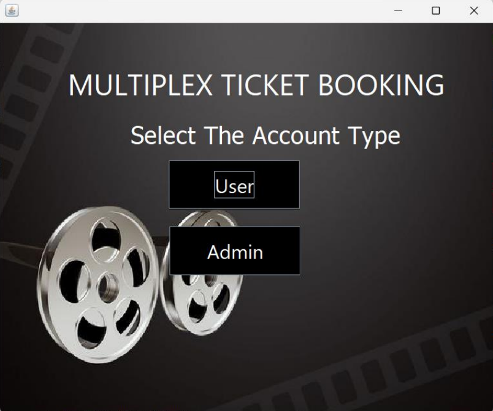
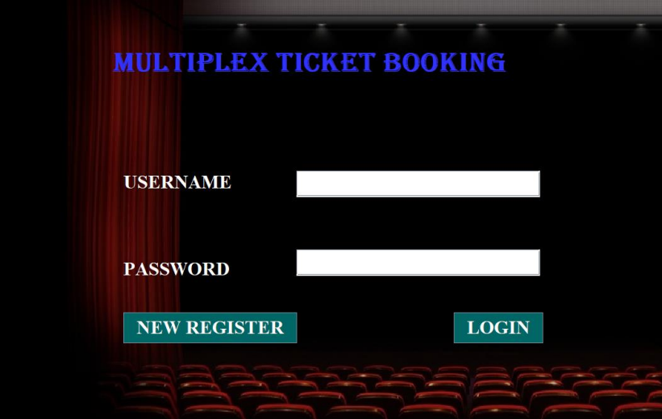
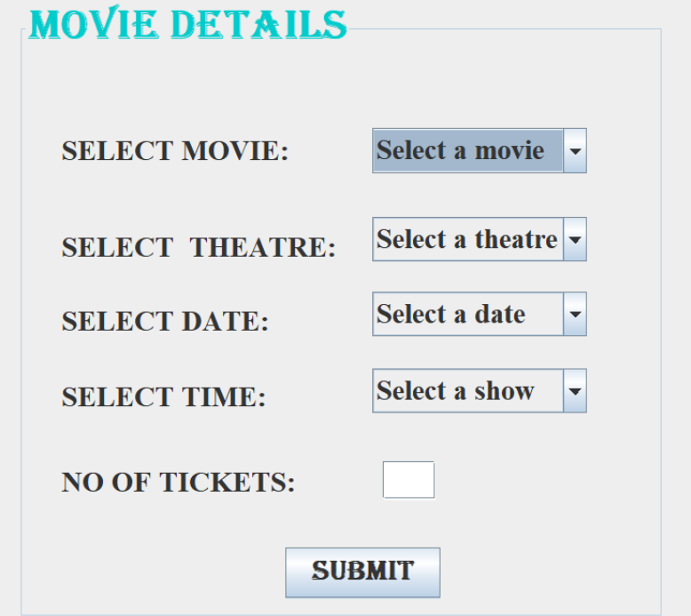
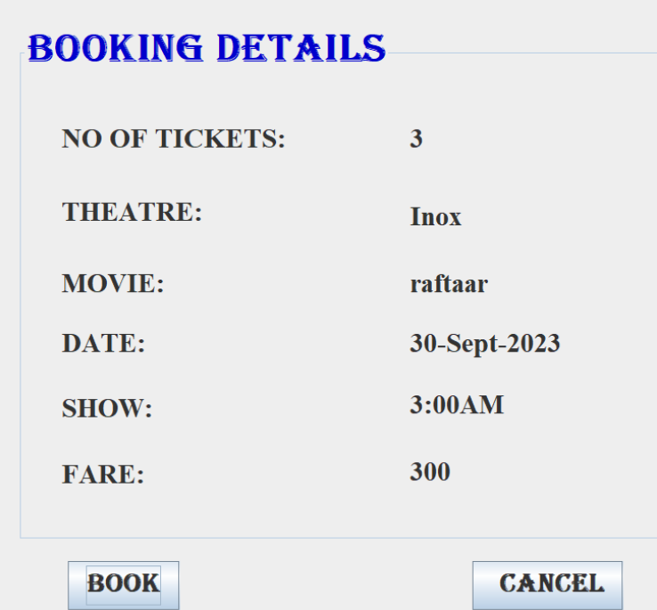
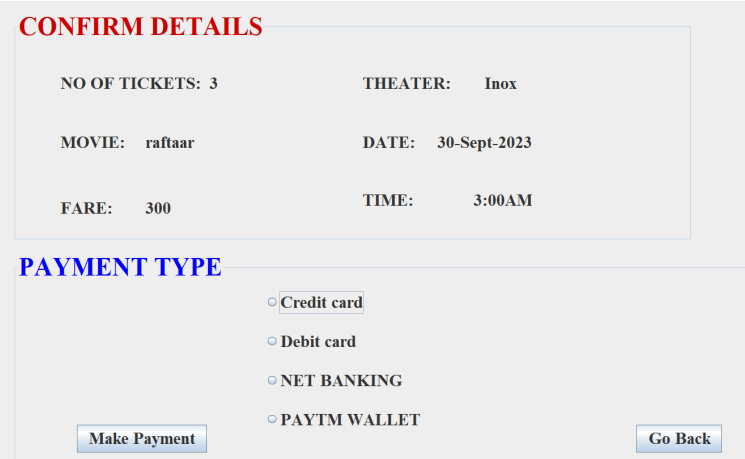
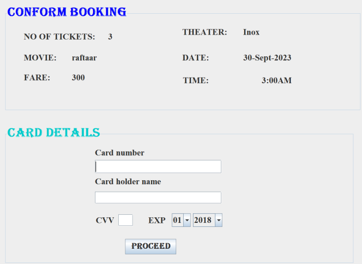
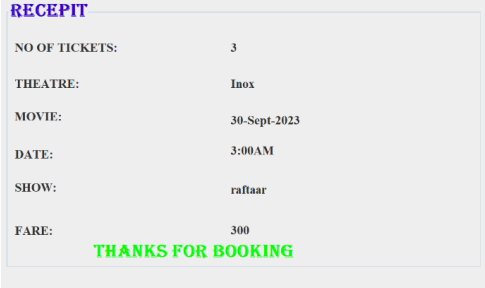
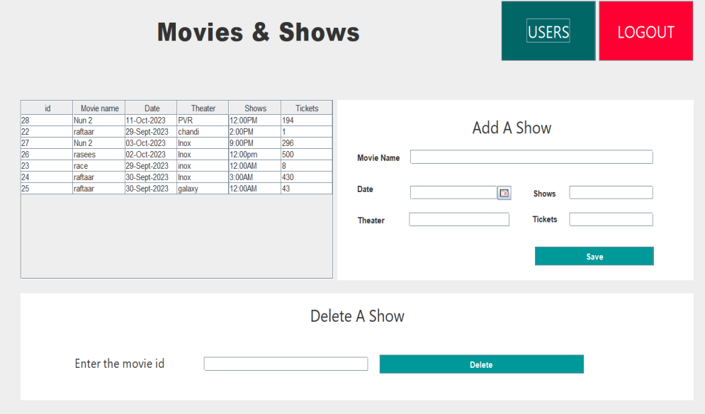
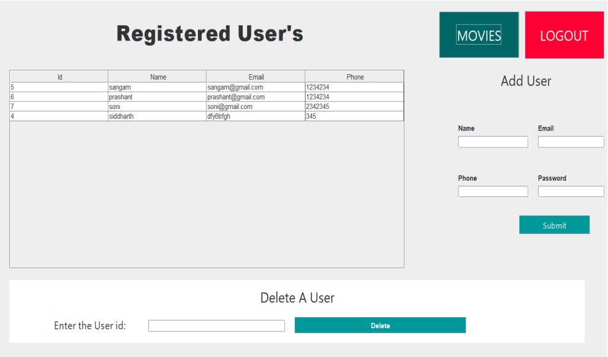

# Movie Ticket Booking System

## Abstract
This project is an online movie ticket reservation system. Users can log in with their username and password, select a movie, choose a theater, pick show timings, and specify the number of tickets they want. The system displays the procedure details and generates a printable form to present at the respective ticket counter for ticket collection.

## Introduction
The primary objective of our online ticket booking system is to offer customers an alternate and convenient method for purchasing cinema tickets. This system operates automatically. Once the data is stored in the database, staff intervention is not required; orders are processed automatically when received through the system.

## Features List
- User Login
- User Registration
- Movie Selection
- Show Time Selection
- Theater Selection
- Ticket Booking
- Display of Booked Tickets with Amount

## Technology Used
- Front end: Java Swing
- Database: MySQL Database
- IDE: NetBeans 8.2 RC

## Preview
###### Main page

###### User Login

###### Movie selection 

###### Booking details

###### Conformation details

###### Payment

###### Receipt

###### Admin Login

###### Admin Home (a)

###### Admin Home (b)
